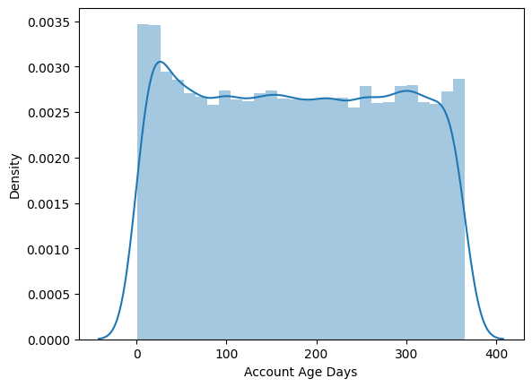
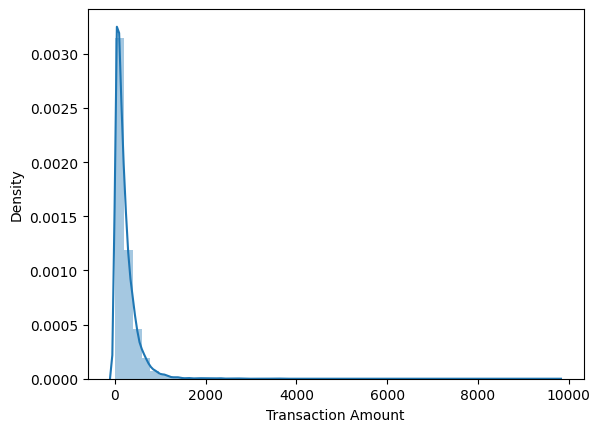
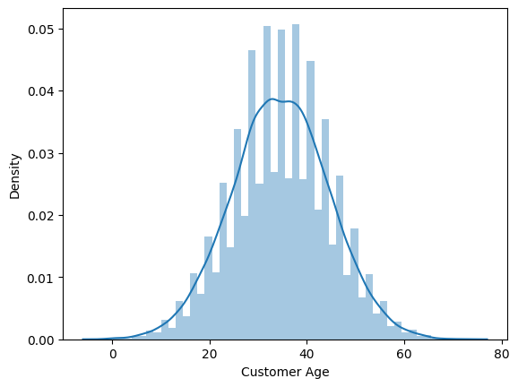

# E-Commerce Fraud Detection

## 📌 Project Overview
This project is a machine learning-based e-commerce fraud detection system designed to identify fraudulent online transactions. Using customer behavior and transaction-related features, the application predicts whether a transaction is fraudulent or legitimate through an interactive **Flask-based web interface**.

---

## 🔗 Quick Links & Previews
* 🖥️ **Home Page:** [View index.html](templates/index.html)
* 🔮 **Prediction Interface:** [View predict.html](templates/predict.html)
* ⚙️ **Backend Logic:** [View app.py](app.py)
* 📊 **Test Data:** [View Sample_Data.csv](Sample_Data.csv)

---

## 📊 Visual Analysis & Performance

### 📈 Transaction Insights
Key behavioral patterns identified during data analysis that help distinguish fraudulent activity.

| Account Age Analysis | Transaction Amount Impact |
|---|---|
|  |  |

### 🔍 Model Evaluation
The system analyzes customer demographics and account history to calculate risk scores.

| Customer Age Distribution | Model Performance Dashboard |
|---|---|
|  |  |

---

## ⚠️ Business Problem
Online e-commerce platforms face significant financial losses due to fraudulent transactions. This project aims to identify high-risk customer segments and suspicious transactions early to reduce risk and improve platform security.

## 🛠️ Technologies Used
* **Backend:** Python, Flask
* **Machine Learning:** XGBoost Classifier, Stacking Classifier
* **Data Science:** Pandas, NumPy, Scikit-learn
* **Frontend:** HTML, CSS, JavaScript

## 🧠 Machine Learning Models
* **Stacking Classifier:** 99% Test Accuracy
* **XGBoost Classifier:** 95% Test Accuracy

## 📂 Project Structure
```bash
E-Commerce-Fraud-Detection/
│
├── templates/          # HTML Templates (index.html, predict.html, etc.)
├── static/             # CSS & JS files
├── img/                # Dashboard and visualization screenshots
├── app.py              # Flask Application entry point
├── Sample_Data.csv     # Preprocessed dataset
├── accage.png          # Account age visualization
├── amount.png          # Transaction amount visualization
├── cage.png            # Customer age visualization
└── README.md           # Project Documentation
